<div align="center">

# Scout

**A multi-agent job-search assistant that lives in your Slack DMs.**

Ask it in plain English. It reads your résumé once, searches real employer job
boards, and ranks what fits — then does it again every morning without being asked.

[](https://python.org)
[](https://langchain-ai.github.io/langgraph/)
[](https://anthropic.com)
[](#built-to-be-maintained)
[](#runs-for-about-10-a-month)
[](https://docs.astral.sh/ruff/)

</div>

---

## What it does

```
You    ▸ any AI/ML roles at Netflix or Databricks this week?

Scout  ▸ Three worth a look, ranked against your résumé:
         1. ML Engineer, Personalization — Netflix, Los Gatos
            Matches your PyTorch + recommender work. Posted 2 days ago.
         2. Software Engineer, ML Platform — Databricks, SF
            Spark and distributed training; lines up with your MS project.
         3. Applied Scientist I — Amazon, Seattle
            Entry-level, NLP focus. Posted yesterday.
```
<sub>Illustrative exchange — real results come from live employer endpoints.</sub>

- **Tailored, not generic.** A résumé-parsing agent distills your background once,
  and every search is run against it — no re-uploading, no re-explaining.
- **Real sources.** Employers' own public endpoints: Amazon's careers JSON,
  Greenhouse's board API, Workday, RSS. Not a scraped aggregator.
- **Shows up on its own.** A daily digest runs every agent and DMs one merged
  briefing each morning.
- **Swap models mid-conversation.** `--claude`, `--ollama`, `--llama`. History is
  provider-agnostic, so the thread survives the switch.

## How it works

```mermaid
flowchart TB
    A["💬 Slack DM"] --> C
    B["⏰ Daily digest, 08:00"] --> C

    C["<b>ConversationalAgent</b><br/><i>the seam — Slack knows nothing else</i>"]

    C --> D{"résumé profile<br/>cached?"}
    D -- no --> E["Résumé Parser<br/><i>own graph, own thread</i>"]
    E --> F
    D -- yes --> F

    subgraph loop ["Agent graph — every agent compiles to this"]
        F["🧠 model"] -->|tool calls| G["🔧 tools"]
        G --> F
    end

    F -->|done| H["📨 reply"]

    G -.-> I["Amazon · Google · Netflix<br/>Greenhouse · Northeastern · BU"]
    F -.-> J["Claude · Ollama · Llama"]
    C -.-> K[("SQLite checkpointer<br/>one thread per user")]
    C -.-> L["📊 metrics · LangSmith · alerts"]

    style C fill:#1C3C3C,color:#fff
    style loop fill:#0d1117,stroke:#30363d
    style K fill:#161b22,stroke:#30363d,color:#8b949e
    style L fill:#161b22,stroke:#30363d,color:#8b949e
    style I fill:#161b22,stroke:#30363d,color:#8b949e
    style J fill:#161b22,stroke:#30363d,color:#8b949e
```



Every agent is **one file** — a system prompt and a list of tools. Adding one
never touches the graph.

## Engineering worth talking about

| Decision | Why |
|---|---|
| **One seam, `ConversationalAgent`** | The Slack layer codes against an interface, so a single agent and the résumé-tailored pipeline take the same path with zero special cases. |
| **History *is* the checkpointer thread** | Provider-agnostic LangChain messages, one thread per user — which is what lets someone switch models mid-conversation without losing context. |
| **A hop limit that repairs itself** | When a turn exhausts its tool budget, the abandoned tool calls are answered before the apology is recorded. Skipping that breaks the user's *next* message, not just this one. |
| **Retry inside the model node** | A node that raises commits nothing, so the fallback starts clean while keeping tool results the turn already fetched. |
| **Tools never raise on expected failure** | A dead job board returns a sentence the model can read and act on, not a stack trace. |
| **Cost is measured, not guessed** | One `turn ...` line per turn records latency, hops, and token usage — which is how we found a trivial reply costs 14.5k input tokens. |

## Built to be maintained

**205 tests, no network, no credentials.** The chat models are scripted and every
HTTP call is stubbed, so the suite runs anywhere in about a second.

```bash
pytest      # 205 passed in 1.02s
ruff check .
```

## Runs for about $10 a month

One `t4g.micro` under systemd. Socket Mode dials out, so there's no inbound port,
no load balancer, and no public surface to attack.

```bash
./deploy/deploy.sh     # rsync, install deps, restart
```

Conversation state and the parsed résumé live in SQLite and survive restarts.
Failures DM you. Traces go to LangSmith when you want them.

## Try it

```bash
python -m venv .venv && source .venv/bin/activate
pip install -r requirements.txt
cp .env.example .env          # add your Slack + Anthropic keys
python run.py
```

Full setup, deployment, and extension guide → **[docs/handbook.md](docs/handbook.md)**

<div align="center">
<sub>Built with LangGraph · Claude · slack-bolt</sub>
</div>
