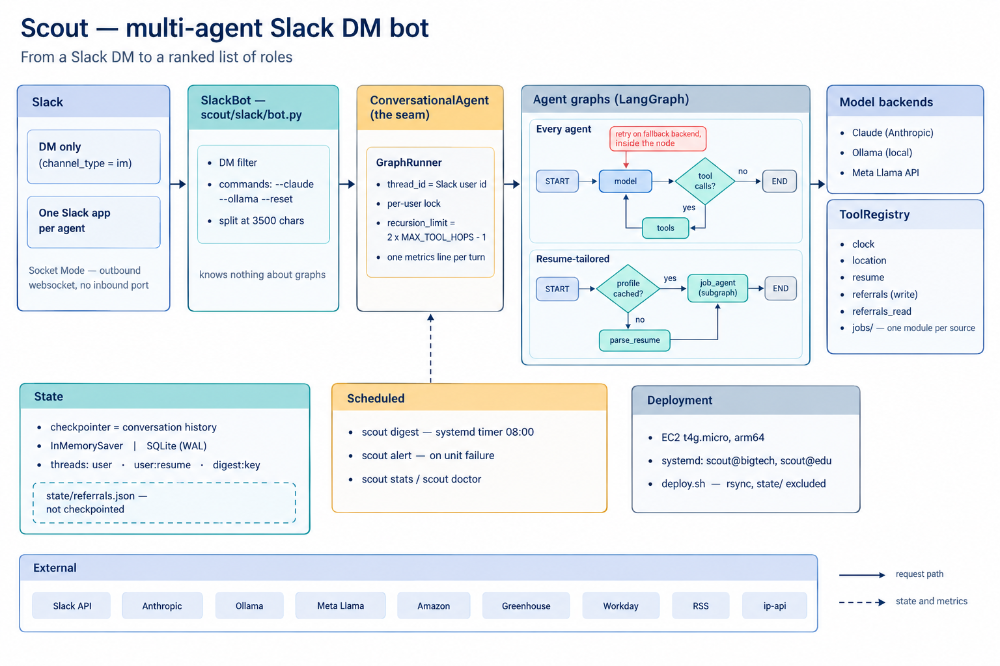

<div align="center">

# Scout

**A multi-agent job-search assistant that lives in your Slack DMs.**

Ask it in plain English. It reads your résumé once, searches real employer job
boards, and ranks what fits — then does it again every morning without being asked.

[](https://github.com/nikhil-kunapareddy/ScoutAI/actions/workflows/ci.yml)
[](LICENSE)
[](https://python.org)
[](https://langchain-ai.github.io/langgraph/)
[](https://docs.astral.sh/ruff/)

</div>

---

```
You    ▸ any AI/ML roles at Netflix or Databricks this week?

Scout  ▸ Three worth a look, ranked against your résumé:
         1. ML Engineer, Personalization — Netflix, Los Gatos
            Matches your PyTorch + recommender work. Posted 2 days ago.
         2. Software Engineer, ML Platform — Databricks, SF
            Spark and distributed training; lines up with your MS project.
         3. Applied Scientist I — Amazon, Seattle
            Entry-level, NLP focus. Posted yesterday.
```

<sub>Illustrative exchange — real results come from live employer endpoints.</sub>

- **Tailored, not generic.** A résumé-parsing agent distils your background
  once, and every search is run against it — no re-uploading, no re-explaining.
- **Real sources.** Employers' own public endpoints: Amazon's careers JSON,
  Greenhouse's board API, Workday, RSS. Not a scraped aggregator.
- **Shows up on its own.** A daily digest runs every agent and DMs one merged
  briefing each morning.
- **Swap models mid-conversation.** `--claude`, `--ollama`, `--llama`. History
  is provider-agnostic, so the thread survives the switch.

## What ships with it

| | Agent | What it searches |
|:--:|---|---|
|  | **BigTech Agent** | Amazon, Google, Netflix, Lenovo, WHOOP, and Greenhouse-hosted boards — Databricks, Airbnb, Stripe, Pinterest, Reddit, Coinbase, Dropbox, Robinhood |
|  | **Edu Agent** | Northeastern University, Boston University |
|  | **Referral Window** | Only the companies you have a connection at — it keeps that list, and searches every board on it in one pass, naming the ones it couldn't check |

Each one is a single file and its own Slack app. A fourth is
[one file too](docs/extending.md#an-agent).

## Quickstart

```bash
git clone https://github.com/nikhil-kunapareddy/ScoutAI.git
cd ScoutAI
make install                  # virtualenv, dependencies, the `scout` command
source .venv/bin/activate
cp .env.example .env          # add your Slack and Anthropic keys
scout doctor                  # says what is still missing
scout run                     # start the bot, then DM it in Slack
```

Creating the Slack app takes about five minutes and is the only fiddly part.
**[docs/getting-started.md](docs/getting-started.md)** walks through all of it.

## How it works

<div align="center">
  
</div>

A Slack DM enters through a Socket Mode adapter that knows nothing about agents.
Everything past that point talks to one interface, `ConversationalAgent`, which
is why a plain agent and the résumé-tailored pipeline take the identical path.

Every agent is **one file**: a system prompt and a list of tools. Adding one
never touches the graph.

## Documentation

| | |
|---|---|
| [Getting started](docs/getting-started.md) | Install, create the Slack app, first conversation |
| [Configuration](docs/configuration.md) | Every setting, and which file it belongs in |
| [Architecture](docs/architecture.md) | The graphs, the seams, and the invariants behind them |
| [Extending](docs/extending.md) | Add an agent, a tool, a job source, or a model provider |
| [Deployment](docs/deployment.md) | Docker, AWS, GCP, and what it costs to run |
| [Operations](docs/operations.md) | The digest, turn metrics, Langfuse tracing, and alerts |

## Contributing

Issues and pull requests are welcome — see
[docs/CONTRIBUTING.md](docs/CONTRIBUTING.md). `make check` runs everything CI runs: ruff,
mypy, and the full suite, which needs no network and no credentials.

<div align="center">
<sub>MIT licensed · built with LangGraph · Claude · slack-bolt</sub>
</div>
