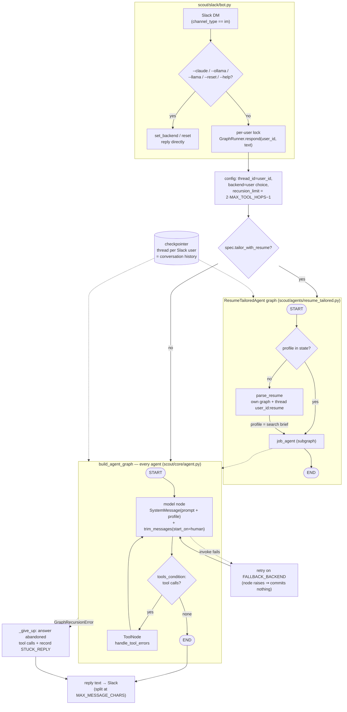

# Architecture

Scout is a small platform, not an application with agents bolted on. An agent is
a declaration — a system prompt and a list of tools — and everything else is
shared: one graph, one runtime, one Slack adapter.

- [The path of a message](#the-path-of-a-message)
- [The two graphs](#the-two-graphs)
- [The three seams](#the-three-seams)
- [Project layout](#project-layout)
- [Design notes](#design-notes)
- [Invariants worth not breaking](#invariants-worth-not-breaking)
- [How it is tested](#how-it-is-tested)

<div align="center">
  
</div>

## The path of a message

```
Slack DM
   │
   ▼
scout/slack/bot.py ────── SlackBot: DM filtering + text commands (--claude, --reset, …)
   │  talks only to ConversationalAgent, so it needs no graph knowledge
   ▼
scout/core/runner.py ──── GraphRunner: one checkpointer thread per user (that
   │                      thread is their history) + their chosen model
   │
   │ (model request)          │ (tool calls)          ▲ declared by
   ▼                          ▼                       │
scout/core/models.py     scout/tools/ ─ ToolRegistry   scout/agents/*.py (AgentSpec)
   ├── ChatAnthropic        ├── clock.py         get_current_time, get_current_date
   ├── ChatOllama           ├── location.py      get_location
   └── ChatOpenAI           ├── resume.py        get_resume_profile
       (Llama, OpenAI-      ├── referrals.py     add_/remove_/list_referrals
        compatible)         ├── referrals_read.py  list_referrals (read-only view)
                            ├── referral_jobs.py   search_referral_jobs (the list
                            │                      as a search scope)
                            └── jobs/            one module per source, over
                                │                    fetch / feeds / posting /
                                │                    relevance / hosted_board /
                                │                    workday
                                ├── amazon.py            search_amazon_jobs
                                ├── google.py            search_google_jobs
                                ├── netflix.py           search_netflix_jobs
                                ├── lenovo.py            search_lenovo_jobs
                                ├── microsoft.py         search_microsoft_jobs
                                ├── apple.py             search_apple_jobs
                                ├── oracle.py            search_oracle_jobs
                                ├── uber.py              search_uber_jobs
                                ├── cisco.py             search_cisco_jobs
                                ├── bloomberg.py         search_bloomberg_jobs
                                ├── greenhouse.py        search_greenhouse_jobs
                                ├── ashby.py             search_ashby_jobs
                                ├── smartrecruiters.py   search_smartrecruiters_jobs
                                ├── workday.py           search_workday_jobs
                                ├── northeastern.py      search_northeastern_jobs
                                ├── boston_university.py search_boston_university_jobs
                                └── directory.py         company -> board, for the
                                                         by-company search
```

## The two graphs

Every agent compiles to the same model/tools loop, built by
`build_agent_graph`:

```
START ──▶ model ──tool calls?──▶ tools ──┐
             │ none                      │
             ▼                           │
            END      ◀───────────────────┘
```

The chosen model decides when to call a tool, the `tools` node runs the
registered Python function in-process and feeds the result back, and the model
folds it into its reply.

An agent with `tailor_with_resume=True` is wrapped in a second graph
(`scout/agents/resume_tailored.py`), which caches the résumé profile *in graph
state*:

```
START ──▶ (profile cached?) ──yes──▶ job_agent ──▶ END
               │ no                  (subgraph)
               ▼                          ▲
         parse_resume ─── profile ────────┘
```

`parse_resume` runs the Resume Parser on its own graph and its own thread, so
the parser's tool calls and JSON reply never land in the job agent's history —
all it contributes is `profile`, the rendered brief, which is appended to the
job agent's instructions on every turn. Because the cache *is* the state, the
router skips the parse on every later turn, and `--reset` drops it.

### The whole turn, in detail



## The three seams

Three interfaces hold the layers apart. They are the reason a change is usually
one file.

**`AgentSpec`** — declares an agent: key, display name, system prompt, tool
modules, default backend, and whether to tailor to the résumé. Adding an agent
must not touch the graph.

**`ConversationalAgent`** — everything `scout/slack/` knows about an agent:
`respond`, `reset`, the backend accessors, `tool_names`. `GraphRunner`
implements it once, for both a plain `Agent` and the two-stage
`ResumeTailoredAgent`, which is why the adapter has no special cases. Nothing in
the Slack layer reaches past it.

**LangChain chat models** — one provider per builder in `scout/core/models.py`,
built on first use. Adding a provider is one function plus one entry in
`_BUILDERS`. Because history is stored as provider-agnostic message objects,
each integration renders the same conversation into its own wire format — which
is what lets a user switch model mid-conversation.

## Project layout

| Path | What lives there |
|------|------------------|
| `scout/cli.py` | The command line: `run`, `digest`, `stats`, `agents`, `doctor` |
| `run.py` | `python run.py` — the same thing as `scout run`, kept for the systemd units |
| `scout/core/agent.py` | `AgentSpec`, `AgentState`, `ConversationalAgent`, the graph builder |
| `scout/core/runner.py` | `GraphRunner`, `Agent` — driving a compiled graph for many users |
| `scout/core/models.py` | One LangChain chat model per backend, built lazily |
| `scout/core/settings.py` | All shared config, from `.env` + `.env.<agent>` |
| `scout/core/checkpoints.py` | In-memory or SQLite checkpointer, per `CHECKPOINT_DB` |
| `scout/core/referrals.py` | The referral store — JSON in `state/`, keyed by user |
| `scout/core/metrics.py` | The one-line-per-turn record |
| `scout/core/tracing.py` | Langfuse: the per-turn call tree, and the only module that knows it exists |
| `scout/core/paths.py` | Filesystem paths, free of config dependencies |
| `scout/core/logging_config.py` | Console + rotating-file logging |
| `scout/tools/` | `ToolRegistry` plus the tool modules |
| `scout/tools/jobs/` | One module per job source, over shared parts (`fetch`, `feeds`, `posting`, `relevance`, `hosted_board`); `directory.py` the company-to-board map |
| `scout/agents/` | One `AgentSpec` per agent, plus `resume_tailored.py` |
| `scout/slack/bot.py` | Slack adapter; talks only to `ConversationalAgent` |
| `scout/slack/formatting.py` | Splitting a reply into Slack-sized messages |
| `scout/slack/notify.py` | Opening a DM nobody asked for (digest, alerts) |
| `scout/digest.py`, `stats.py`, `alert.py` | Scheduled entry points, read-back, failure DM |
| `scout/checks.py` | What `scout doctor` reports |
| `deploy/` | `deploy.sh` plus the systemd units the box runs |
| `tests/` | The suite: no network, no credentials |

## Design notes

| Decision | Why |
|---|---|
| **One seam, `ConversationalAgent`** | The Slack layer codes against an interface, so a single agent and the résumé-tailored pipeline take the same path with zero special cases. |
| **History *is* the checkpointer thread** | Provider-agnostic LangChain messages, one thread per user — which is what lets someone switch models mid-conversation without losing context. |
| **A hop limit that repairs itself** | When a turn exhausts its tool budget, the abandoned tool calls are answered before the apology is recorded. Skipping that breaks the user's *next* message, not just this one. |
| **Retry inside the model node** | A node that raises commits nothing, so the fallback starts clean while keeping tool results the turn already fetched. |
| **Tools never raise on expected failure** | A dead job board returns a sentence the model can read and act on, not a stack trace. |
| **One module per job source** | The platforms differ too much to share an implementation: a JSON search API, a board API, Workday, RSS, a scraped page. What they *do* share is split by job into `fetch`, `feeds`, `posting` and `relevance`, and a platform that hosts many companies is one shape rather than one module each — `HostedBoard` for Greenhouse, Ashby and SmartRecruiters, `WorkdayTenant` for the Workday sites. |
| **The digest derives its agents** | `tailor_with_resume` is the marker, so a new job agent joins tomorrow's digest by existing. There is no second registry to keep in step. |
| **Cost is measured, not guessed** | One `turn …` line per turn records latency, hops, and token usage — which is how we found that a trivial reply costs 14.5k input tokens. |
| **Observability is a config, not a code path** | `GraphRunner.respond` hands its run config to `tracing.observed` and gets back either an instrumented one or the one it already had, so a traced turn and an untraced turn take the same path. Nothing else in the package imports Langfuse. |

## Invariants worth not breaking

Each of these has a test. If you find yourself deleting one, read the entry
first — most of them exist because the alternative broke something subtle.

- **`trim_messages(..., start_on="human")` is load-bearing.** Providers reject a
  conversation that opens on the assistant's side, and a tool result must never
  lead the window or be split from the call it answers.
- **`bind_tools` discards kwargs bound before it.** In `models.with_tools`, the
  provider options go on *after* the tools or they vanish silently.
- **The hop limit repairs the thread.** On `GraphRecursionError`, `_give_up`
  answers the abandoned tool calls before recording the apology.
- **A subgraph is handed the recursion limit afresh**, so `_min_steps` is a
  floor, never an addition — adding to it hands the inner loop extra tool hops.
- **The fallback retry lives in the model node**, not around the turn.
- **The annotation `RunnableConfig` must stay exactly that.** Widening it to
  `RunnableConfig | None` stops LangChain recognising it: the injection quietly
  stops and `config` reappears as a parameter the model is asked to fill — with
  a user id in it.
- **Job agents get `referrals_read`, never `referrals`.** Only the Referral
  Window may write. A searching agent with `add_referral` in reach eventually
  records something mid-search that the user never asked for.
- **The Referral Window searches, but only inside the list.** It holds
  `search_referral_jobs` and none of the per-source tools, which is what makes
  the previous rule survive an agent that both writes the list and searches: it
  has nothing to search *with* off the list. Giving it a source tool would undo
  that.
- **The by-company search names its gaps.** `search_referral_jobs` reports a
  board it couldn't reach and a company it has no board for, separately from
  "nothing open". The agent's only claim is that its answer is complete, and a
  silently short list is the one way to break it — which is also why the routing
  from company to board is a table in `jobs/directory.py` and not a prompt.
- **Per-user locks stay.** slack-bolt dispatches on a thread pool; one lock per
  user serialises their turns while other users run concurrently.
- **The referral list is deliberately *not* checkpointed.** History is
  disposable; a list the user typed once is not.
- **The digest runs on `digest:<key>` threads, which are not people.**
  `owner_for` maps them onto `DIGEST_SLACK_USER`; without that the daily report
  looks up a user id that has no referrals and quietly stops ranking by them.
- **Two bots on one `CHECKPOINT_DB` share a thread.** Thread ids are the bare
  Slack user id, so each interactive agent needs its own database path.
- **`settings` must not raise on import.** That is what keeps the package
  importable — and the suite runnable — without a `.env`.
- **Monitoring never breaks a turn.** The Langfuse client, its import, and its
  handler are built inside one `try` that logs and leaves tracing off; the
  config `respond` traces with is a copy, so the checkpointer reads and the
  `_give_up` repair stay outside the trace.

## How it is tested

The suite runs in about a second, with no network, no credentials, and no
`.env`:

- **Chat models are scripted.** `ScriptedModel` in `tests/conftest.py` is
  installed into `scout.core.models` as a real backend, so the graph reaches it
  through `build`/`with_tools`/`label` exactly as it reaches Claude. It records
  every message list it was handed, which is how the instructions, the trimming,
  and the tool results are asserted.
- **HTTP is stubbed.** `FakeRequests` stands in for the `requests` module and
  records every call, so each job source is exercised through its registered
  tool — including the "source is down" path, which must return readable text
  rather than raise.
- **The invariants have names.** `test_tools_and_request_options_both_survive_binding`,
  `test_the_user_id_is_not_in_the_schema_the_model_sees`, and friends read as
  the sentences above.

```bash
make check     # ruff, mypy, and the suite with coverage — what CI runs
```
