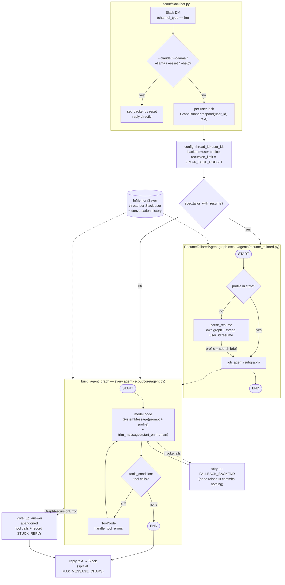

# Orchestration flow

```mermaid
flowchart TB
    subgraph slack["scout/slack/bot.py"]
        DM["Slack DM<br/>(channel_type == im)"] --> CMD{"--claude / --ollama /<br/>--llama / --reset / --help?"}
        CMD -- yes --> LOCAL["set_backend / reset<br/>reply directly"]
        CMD -- no --> LOCK["per-user lock<br/>GraphRunner.respond(user_id, text)"]
    end

    LOCK --> CFG["config: thread_id=user_id,<br/>backend=user choice,<br/>recursion_limit = 2·MAX_TOOL_HOPS−1"]

    CFG --> TAILOR{"spec.tailor_with_resume?"}

    TAILOR -- no --> LOOP
    TAILOR -- yes --> OUTER

    subgraph OUTER["ResumeTailoredAgent graph (scout/agents/resume_tailored.py)"]
        direction TB
        R0([START]) --> R1{"profile in state?"}
        R1 -- yes --> R3["job_agent (subgraph)"]
        R1 -- no --> R2["parse_resume<br/>own graph + thread user_id:resume"]
        R2 -- "profile = search brief" --> R3
        R3 --> R4([END])
    end

    R3 -.-> LOOP

    subgraph LOOP["build_agent_graph — every agent (scout/core/agent.py)"]
        direction TB
        G0([START]) --> M["model node<br/>SystemMessage(prompt + profile)<br/>+ trim_messages(start_on=human)"]
        M --> TC{"tools_condition:<br/>tool calls?"}
        TC -- yes --> T["ToolNode<br/>handle_tool_errors"]
        T --> M
        TC -- none --> G1([END])
    end

    M -. "invoke fails" .-> FB["retry on FALLBACK_BACKEND<br/>(node raises ⇒ commits nothing)"]
    FB --> M

    G1 --> OUT["reply text → Slack<br/>(split at MAX_MESSAGE_CHARS)"]
    LOOP -. "GraphRecursionError" .-> GIVEUP["_give_up: answer abandoned<br/>tool calls + record STUCK_REPLY"]
    GIVEUP --> OUT

    CKPT[("InMemorySaver<br/>thread per Slack user<br/>= conversation history")] -.-> LOOP
    CKPT -.-> OUTER
```
